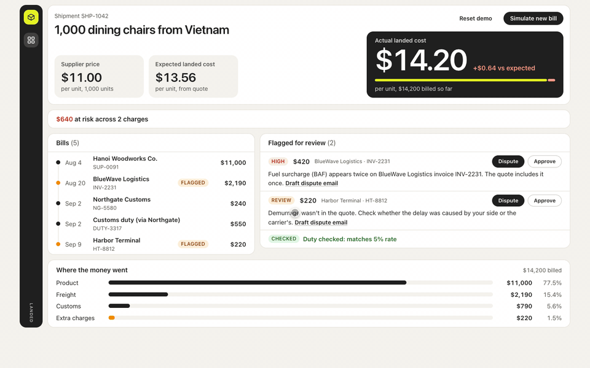

# Landed

Landed groups every bill for one import shipment, shows the true landed cost per unit, and flags charges that do not match the original quote. It is a hackathon prototype running entirely on hardcoded sample data.

Live demo: https://landed-ramp.vercel.app



## Features

The figures below are the sample data's starting state.

**Landed cost**
- One shipment (SHP-1042, 1,000 dining chairs from Vietnam) with all its bills grouped together.
- Three per-unit figures: supplier price ($11.00), expected landed cost from the quote ($13.56) and actual landed cost from the bills ($14.20).
- The gap between actual and expected (+$0.64), with a bar showing the expected share against the overage.
- Total billed so far ($14,200).

**Money at risk**
- A running total of unresolved flagged charges: "$640 at risk across 2 charges".
- "If disputes succeed: $13.78/unit" appears once a charge is disputed.
- Changes to "$0 at risk. All flagged charges reviewed." when every flag is approved.

**Bill timeline**
- Bills in date order, each with date, vendor, bill id and total.
- A bill with an unresolved flag gets an orange dot and a FLAGGED badge. Both clear once its flags are approved.
- Click a bill to highlight its flags. Click again to clear.

**Audit rules** (run on every bill line; a line gets at most one flag)
- Duplicate charge (HIGH): the same charge and amount billed twice on one invoice.
- Not in quote (REVIEW): a charge the quote never listed, with specific wording for demurrage and storage.
- Above quote (REVIEW): billed more than quoted, flagged for the difference.
- Duty mismatch (REVIEW): duty differs from the declared rate by more than $1.
- When duty matches, a green "Duty checked: matches 5% rate" line shows.
- The sample data triggers the first two rules (fuel surcharge duplicate $420, demurrage $220). The other two are built and covered by tests.

**Flags**
- Each flag shows severity, amount at risk, vendor, bill id and a plain-English reason, sorted by severity and then amount.
- Dispute marks it Disputed. It stays in money at risk and feeds the "if disputes succeed" figure.
- Approve marks it Approved and removes it from money at risk.
- Draft dispute email opens a pre-written message to the vendor, filled in from the flag. Nothing is sent.

**Cost breakdown**
- "Where the money went": bars for Product, Freight, Customs and Extra charges, each with amount and percentage.

**Demo controls**
- Simulate new bill adds a late storage bill ($180): actual cost moves to $14.38, a third flag appears, and $820 is at risk. The button disables after one use.
- Reset demo restores the starting state, including flag statuses and the selected bill.
- Every section updates together, because costs and flags are recalculated from the bills each time.

**Motion, keyboard and layout**
- The actual cost counts up when it changes, and the new bill, its flag and the cost number get a lime highlight.
- Breakdown bars grow in on load and resize when totals change.
- Every control works from the keyboard with a visible focus ring. Escape closes the email draft.
- Fits 1440x900 and 1920x1080 without scrolling, and stacks on a phone-width screen.

## Run it

```
npm install
npm run dev
```

Tests:

```
npm test
```

Production build and preview:

```
npm run build
npm run preview
```

Deploys on Vercel with default Vite settings (build command `npm run build`, output directory `dist`), no extra config.

## Demo path

1. Open the page. Supplier price is $11.00 per chair for 1,000 chairs.
2. The bill timeline shows five bills from the supplier, forwarder, broker, customs and terminal.
3. Actual landed cost is $14.20 per chair against an expected $13.56 from the quote (+$0.64).
4. Two charges are flagged for review, $640 at risk: a fuel surcharge billed twice ($420) and demurrage that was not in the quote ($220).
5. Click **Dispute** on the fuel surcharge. Money at risk stays at $640 and "If disputes succeed: $13.78/unit" appears.
6. Click **Simulate new bill**. A late storage bill arrives: actual cost moves to $14.38, a third flag appears ($180), and $820 is at risk.
7. Click **Reset demo** to return to the starting state.

Also available: click a bill to highlight its flags, **Approve** a flag to take it out of money at risk, and **Draft dispute email** to see a pre-written message to the vendor.

## 90-second demo script

Before you start:

1. Open https://landed-ramp.vercel.app in a full-screen browser window at 100% zoom, on a screen at least 1440x900.
2. Click **Reset demo** so you begin from the starting state.
3. Simulate new bill works once per run, so do not click it early.

| Time | Do | Say |
|---|---|---|
| 0:00-0:15 | Point at the title, then Supplier price | "An importer orders 1,000 chairs at $11 each. But $11 isn't what a chair costs them. Freight, customs and terminal fees arrive later, on separate bills, from different vendors." |
| 0:15-0:25 | Run the cursor down the Bills list | "Here are five bills from five vendors over five weeks. Today, nobody adds these up per shipment." |
| 0:25-0:40 | Point at the big number, then Expected | "Landed does. Each chair really cost $14.20. The quote said $13.56. So where's the 64 cents?" |
| 0:40-0:55 | Point at the two flags | "It checks every line against the quote. A fuel surcharge billed twice, $420. And $220 of demurrage that was never quoted. That's $640 at risk on one shipment." |
| 0:55-1:05 | Click **Dispute** on the $420 flag | "One click to dispute it. If that dispute succeeds, the cost drops to $13.78 a chair." |
| 1:05-1:20 | Click **Simulate new bill** and pause while the number counts up | "Two weeks later the terminal sends another bill. The cost updates live to $14.38, and there's a third flag." |
| 1:20-1:30 | Stop clicking and face the judges | "Without this, they'd find out their margins were wrong months later. Landed tells them the day the bill arrives." |

If there is spare time or a question:

- Click **Draft dispute email** on a flag to show the pre-written message to the vendor. Press Escape to close it.
- Click a bill in the timeline to highlight the charges it caused.

Say these plainly if asked:

- It runs on sample data for one shipment.
- Flags mean "worth checking", not "proven wrong".
- The $640 and $820 figures come from this sample shipment. They are not typical savings.
- It does not read real invoices, send emails or connect to Ramp.

## Limitations

- All data is hardcoded in `src/data/shipment.json`. There is one shipment, in USD only.
- No real bill or invoice extraction, and no matching of bills to shipments. The bills are already structured in the sample data.
- The dispute email is a filled-in text template shown on screen. Nothing is sent.
- No Ramp API or any other integration, no backend, no login.
- The side rail icons are decorative, not navigation.
- No undo on Dispute or Approve other than Reset demo.
- Flags mean "flagged for review". They are simple rule checks against the quote, not proof that a charge is wrong.
- Built for desktop demo use (checked at 1440x900 and 1920x1080). The layout stacks on a phone-width screen but that is not the target.
